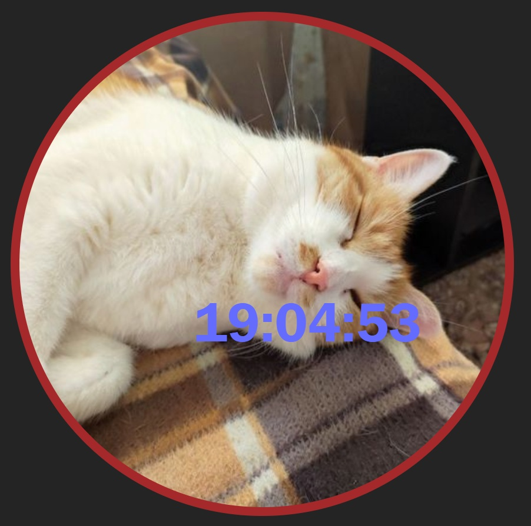

# React + Vite

A digital clock with a random cat background, updating every minute. Built with React and Vite, styled with custom CSS.

## Finished Product:

  

## Source:

API for cat images:

  <a href="https://cataas.com" target="_blank">cataas.com</a>

vite.dev

  <a href="https://vite.dev" target="_blank">Vite</a>

